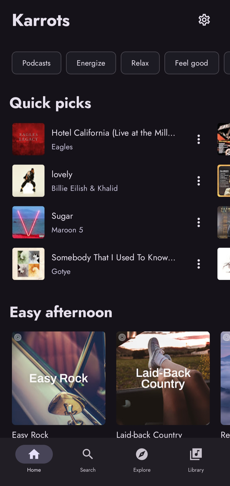
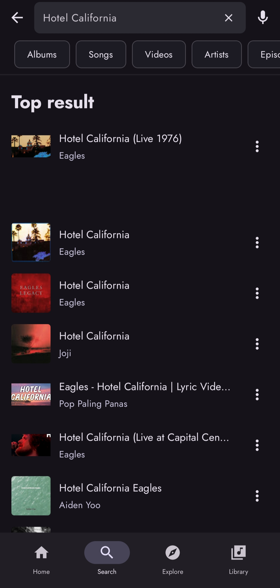
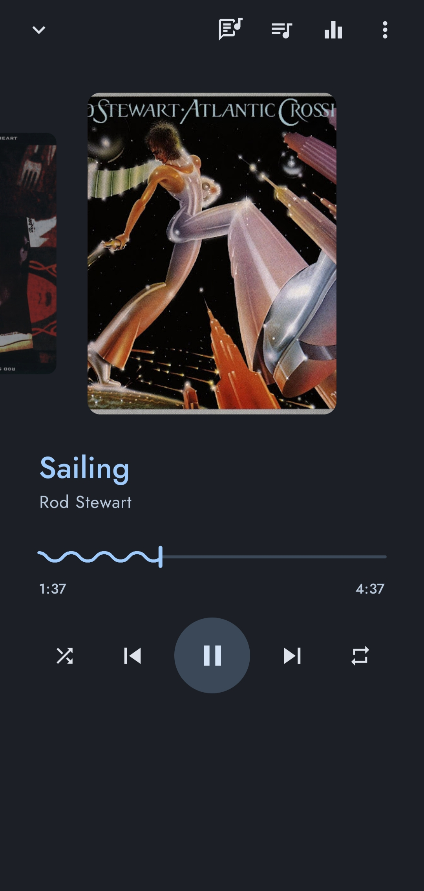
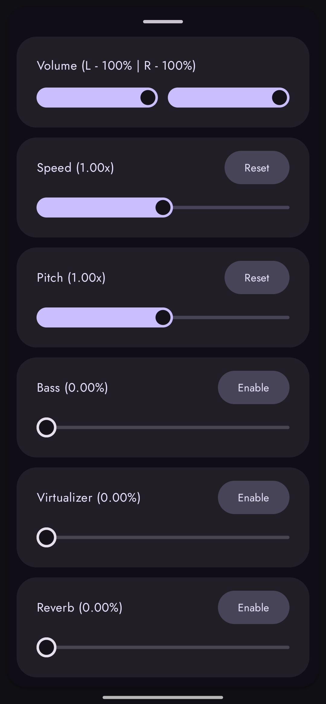

# 🥕 Karrots
A high-performance Android application for seamless audio playback and streaming. Built with a modern **Material 3** interface and powered by the **YouTube Music** public API.

---

## 📱 App Showcase

| Home | Search | Player | Equalizer |
| :---: | :---: | :---: | :---: |
|  |  |  |  |

---

## 🚀 Features
* **Modern UI:** Built entirely with **Jetpack Compose** and **Material 3** for a sleek, responsive experience.
* **Streaming & Playback:** High-quality audio streaming via the YouTube Music API.
* **Advanced Audio Control:** Integrated equalizer for a personalized listening experience.
* **Efficient Networking:** Optimized API requests to ensure low data usage and fast loading times.

## 🛠️ Tech Stack
* **Language:** Kotlin
* **UI Framework:** Jetpack Compose (Material3)
* **Networking:** Ktor
* **Audio Engine:** ExoPlayer / Media3

---

## 🔧 Installation & Build
1. Clone the repository:
   ```bash
   git clone https://github.com/drakulah/Karrots.git
   ```
